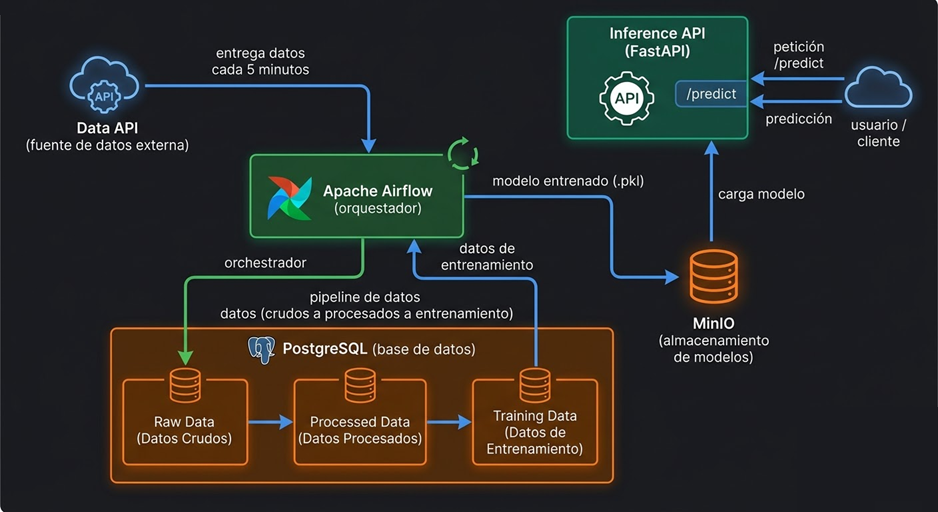

# Proyecto 1 MLOps — Orquestación, Entrenamiento y Modelos

**Pontificia Universidad Javeriana — Maestría en Inteligencia Artificial**
Curso: Operaciones de Machine Learning
Grupo: Juan Navas, Maria Camila Cuella, Jonathan

---

## ¿Qué es MLOps?

MLOps (Machine Learning Operations) es la práctica de llevar modelos de Machine Learning a producción de forma **automatizada, reproducible y escalable**. Combina las prácticas de desarrollo de ML con las de DevOps.

Sin MLOps, el flujo típico es manual: un científico de datos entrena un modelo en su computadora y lo entrega como un archivo. Con MLOps, todo el flujo — desde la recolección de datos hasta la predicción en producción — corre solo, de forma programada y trazable.

---

## Descripción del proyecto

El sistema recolecta automáticamente datos del dataset *Forest Cover Type* a través de una API externa, los procesa en tres etapas usando Airflow, almacena los datos en PostgreSQL, entrena un modelo de clasificación y lo expone mediante una Inference API.

**El modelo predice el tipo de cobertura forestal** (7 clases) a partir de variables cartográficas como elevación, pendiente, distancia a fuentes de agua y tipo de suelo.

---

## Conceptos clave

### ¿Qué es Docker?

Docker es un programa que crea ambientes aislados llamados **contenedores**. Cada contenedor tiene su propio sistema de archivos, procesos y red — como una máquina virtual muy liviana.

```
Tu computadora (Windows)
└── Docker Desktop
    ├── contenedor: mlops_postgres       ← tiene PostgreSQL adentro
    ├── contenedor: mlops_airflow_webserver
    ├── contenedor: mlops_minio
    └── ... etc
```

**¿Por qué Docker?** Porque permite que el mismo sistema corra igual en cualquier máquina — tu laptop, la de tu compañero, o una VM en la nube — con un solo comando.

### ¿Dónde se guardan los datos?

Los datos **no** están en una carpeta visible de tu computadora. Están en **volúmenes de Docker** — ubicaciones internas gestionadas por Docker dentro de WSL 2 (un mini Linux que Docker Desktop instala automáticamente en Windows).

```
Tu carpeta del proyecto (visible)     Docker (invisible)
├── docker-compose.yml                ├── volumen: postgres_data      ← 63,910 filas
├── dags/                             ├── volumen: postgres_airflow_data
├── data_api/                         └── volumen: minio_data         ← modelos .pkl
└── init_db/
```

Los volúmenes persisten aunque apagues los contenedores. Solo se borran con `docker compose down -v`.

### ¿Qué es una API?

Una API (Application Programming Interface) es una forma estándar de que dos programas se comuniquen. El cliente hace una petición, el servidor la procesa y responde.

```
Cliente (DAG de Airflow)
    │
    │  GET http://data-api:80/data?group_number=6
    ▼
Servidor (Data API)
    │  busca el batch, toma muestra aleatoria
    ▼
Respuesta JSON:
{
  "group_number": 6,
  "batch_number": 3,
  "data": [["2596", "51", "3", ...], ...]
}
```

Los verbos más comunes son `GET` (pedir datos) y `POST` (enviar datos para procesar).

### ¿Qué es MinIO?

MinIO es un sistema de almacenamiento de objetos compatible con S3 de AWS, pero que corre localmente. Es el lugar correcto para guardar archivos binarios grandes como modelos entrenados (`.pkl`), en lugar de meterlos en una base de datos relacional.

---

## Arquitectura

El sistema sigue una **arquitectura de microservicios** — cada componente hace una sola cosa y se comunica con los demás por red. Lo opuesto sería un sistema monolítico donde todo está junto en un solo proceso. Esta separación permite reemplazar, escalar o modificar cada parte de forma independiente sin afectar al resto.




### ¿Por qué cada componente?

| Componente | Razón |
|---|---|
| **Airflow** | Orquesta los flujos de trabajo — sabe qué tareas correr, en qué orden, cuándo, y qué hacer si fallan |
| **PostgreSQL** | Guarda los datos en 3 etapas para que si hay un error en el procesamiento, los datos crudos sigan intactos |
| **MinIO** | Los modelos son archivos binarios grandes — un sistema de objetos es más adecuado que una base de datos relacional |
| **FastAPI** | Expone el modelo como servicio web para que cualquier sistema pueda hacer predicciones via HTTP |
| **Docker Compose** | Levanta todos los servicios juntos con un solo comando, garantizando que se comunican correctamente |

### Servicios

| Servicio | Puerto | Descripción |
|---|---|---|
| Airflow Webserver | 8080 | Interfaz para monitorear y ejecutar DAGs |
| MinIO Console | 9001 | Interfaz para gestionar modelos almacenados |
| MinIO API | 9000 | API S3-compatible para subir/bajar modelos |
| Data API | 8000 | Réplica local de la API del profesor |
| Inference API | 8001 | API de predicción del tipo de cobertura forestal |
| PostgreSQL (proyecto) | 5432 | Base de datos con los datos del pipeline |

---

## Dataset — Forest Cover Type

El dataset original tiene **581,012 filas** divididas en 10 batches de ~58,101 filas cada uno. La API entrega una muestra aleatoria de 1/10 de cada batch por solicitud (~5,810 filas). Para cubrir los 10 batches se necesitan **10 solicitudes** (~58,100 filas totales).

| Columna | Tipo | Descripción |
|---|---|---|
| elevation | numérico | Elevación en metros |
| aspect | numérico | Orientación en grados azimut |
| slope | numérico | Pendiente en grados |
| horizontal_distance_to_hydrology | numérico | Distancia horizontal a agua |
| vertical_distance_to_hydrology | numérico | Distancia vertical a agua |
| horizontal_distance_to_roadways | numérico | Distancia a carreteras |
| hillshade_9am / noon / 3pm | numérico | Índice de sombra (0-255) |
| horizontal_distance_to_fire_points | numérico | Distancia a puntos de ignición |
| wilderness_area | categórico | 4 posibles valores (texto) |
| soil_type | categórico | 40 posibles valores (texto) |
| **cover_type** | entero (1-7) | Variable objetivo |

---

## Pipeline de datos

### ¿Por qué 3 tablas?

En MLOps es buena práctica no transformar los datos en el mismo paso en que se guardan. Si hay un error en el procesamiento, los datos crudos siguen intactos y se puede reprocesar sin volver a llamar a la API.

```
raw_data  ──►  processed_data  ──►  training_data
  (crudo)         (limpio)           (encodificado)
```

### raw_data → processed_data (limpieza)

Se descartan filas que tengan:
- Campos vacíos o nulos
- `cover_type` fuera del rango 1-7
- Valores de hillshade fuera del rango 0-255

### processed_data → training_data (One-Hot Encoding)

Los modelos de ML no trabajan con texto — solo con números. Las columnas categóricas se convierten a columnas binarias:

```
"Rawah"     → wilderness_area_1=1, wilderness_area_2=0, wilderness_area_3=0, wilderness_area_4=0
"Cathedral" → soil_type_1=1, soil_type_2=0, ..., soil_type_40=0
```

**Resultado: 54 features numéricas + 1 variable objetivo = 55 columnas**

### ¿Sobre qué tabla se valida antes de entrenar?

Sobre `raw_data` — porque refleja exactamente cuántas solicitudes se hicieron a la API, independientemente de cuántas filas se perdieron en la limpieza. Si validáramos sobre `training_data` podríamos rechazar un entrenamiento válido por datos sucios, que es un problema de calidad distinto al de recolección.

---

## DAGs de Airflow

### DAG 1 — `data_collection` (cada 5 minutos)

Cada ejecución hace **exactamente 1 petición** a la API (restricción del enunciado) y la procesa completa:

```
fetch_data → save_raw_data → process_data → prepare_training_data
```

Los datos entre tareas se pasan via **XCom** — un buzón interno de Airflow. `fetch_data` deposita la respuesta de la API y las tareas siguientes la leen de ahí, sin volver a llamar a la API.

### DAG 2 — `model_training` (disparo manual)

Se ejecuta manualmente cuando ya se recolectaron suficientes datos:

```
check_data → train_model → save_to_minio
```

| Tarea | Qué hace |
|---|---|
| `check_data` | Verifica ≥ 58,000 filas en `raw_data` (10 batches completos) |
| `train_model` | Carga datos de `training_data`, entrena RandomForest 80/20, evalúa accuracy |
| `save_to_minio` | Guarda `model_TIMESTAMP.pkl` y `model_TIMESTAMP.json` en MinIO |

### ¿Por qué RandomForest?

- Funciona bien con datos mixtos (numéricos + categóricos codificados)
- Robusto sin necesidad de normalización previa
- 100 árboles votan la clase — más robusto que un solo árbol de decisión
- Estándar en clasificación sobre datos tabulares

### ¿Qué son los archivos en MinIO?

- **`.pkl`** — el modelo serializado con pickle. Contiene los 100 árboles con todos sus parámetros aprendidos. Se carga con `pickle.load()` para hacer predicciones sin reentrenar.
- **`.json`** — las métricas del modelo (accuracy, fecha de entrenamiento, número de muestras). Permite saber qué tan bueno es el modelo sin cargarlo.

---

## Inference API

Expuesta en `http://localhost:8001`. Al arrancar carga automáticamente el modelo más reciente de MinIO.

### Endpoints

| Método | Ruta | Descripción |
|---|---|---|
| `GET /` | `/` | Health check — confirma que la API está viva y qué modelo tiene cargado |
| `POST /predict` | `/predict` | Recibe datos crudos y devuelve la predicción |

### Ejemplo de predicción

```bash
curl -X POST http://localhost:8001/predict \
  -H "Content-Type: application/json" \
  -d '{
    "elevation": 2596, "aspect": 51, "slope": 3,
    "horizontal_distance_to_hydrology": 258,
    "vertical_distance_to_hydrology": 0,
    "horizontal_distance_to_roadways": 510,
    "hillshade_9am": 221, "hillshade_noon": 232, "hillshade_3pm": 148,
    "horizontal_distance_to_fire_points": 6279,
    "wilderness_area": "Rawah", "soil_type": "Cathedral"
  }'
```

### Respuesta

```json
{
  "cover_type": 2,
  "cover_type_name": "Lodgepole Pine",
  "model_used": "model_20260314_211612.pkl"
}
```

---

## Requisitos

- [Docker Desktop](https://www.docker.com/products/docker-desktop/) instalado y corriendo
- Git

---

## Cómo levantar el sistema

### 1. Clonar el repositorio

```bash
git clone https://github.com/JuanNavas38/mlops-proyecto1.git
cd mlops-proyecto1
```

### 2. Levantar todos los servicios

```bash
docker compose up -d
```

La primera vez tarda varios minutos — descarga imágenes y Airflow instala sus dependencias.

### 3. Verificar que todo está corriendo

```bash
docker ps --format "table {{.Names}}\t{{.Status}}"
```

Todos los servicios deben aparecer como `Up`. `mlops_airflow_init` desaparece al terminar — es normal.

### 4. Acceder a las interfaces

| Interfaz | URL | Usuario | Contraseña |
|---|---|---|---|
| Airflow | http://localhost:8080 | admin | admin123 |
| MinIO Console | http://localhost:9001 | minioadmin | minioadmin123 |
| Data API docs | http://localhost:8000/docs | — | — |
| Inference API docs | http://localhost:8001/docs | — | — |

### 5. Activar la recolección de datos

En Airflow (http://localhost:8080), activar el DAG `data_collection`. Comenzará a recolectar datos cada 5 minutos. Para tener los 10 batches completos se necesitan **al menos 50 minutos**.

### 6. Entrenar el modelo

Una vez acumuladas ≥58,000 filas, disparar manualmente el DAG `model_training` desde Airflow. El modelo quedará guardado en MinIO (http://localhost:9001 → bucket `models`).

---

## Verificar los datos recolectados

```bash
docker exec mlops_postgres psql -U admin -d mlops_db -c \
  "SELECT 'raw_data' AS tabla, COUNT(*) FROM raw_data \
   UNION ALL SELECT 'processed_data', COUNT(*) FROM processed_data \
   UNION ALL SELECT 'training_data', COUNT(*) FROM training_data;"
```

---

## Nota sobre los datos entre compañeros

Cada persona que clone el repo y levante el sistema acumulará sus **propios datos** en su máquina — son muestras aleatorias del mismo dataset, por lo que no serán idénticos entre compañeros. Esto es el comportamiento esperado. La integración ocurre cuando el sistema se despliega en la VM compartida del grupo.

---

## Apagar el sistema

```bash
# Apagar conservando los datos
docker compose down

# Apagar y borrar todos los datos
docker compose down -v
```

---

## Evidencias de funcionamiento

### 1. Airflow — lista de DAGs

Ambos DAGs detectados y funcionando: `data_collection` (activo, schedule cada 5 min) y `model_training` (disparado manualmente, schedule None). Se pueden ver 11 ejecuciones exitosas, 1 en curso y 111 fallidas del DAG de recolección — las fallas corresponden a ejecuciones donde la API aún no había cambiado de batch (cooldown de 5 minutos).


---

### 2. Airflow — historial del DAG `data_collection`

Vista Grid del DAG de recolección mostrando múltiples ejecuciones programadas. Los cuadros rojos son ejecuciones donde `fetch_data` falló por el cooldown de 5 minutos de la API — comportamiento esperado. Los cuadros verdes confirman ejecuciones exitosas donde se recolectaron y procesaron datos completos.


---

### 3. Airflow — DAG `model_training` exitoso

El DAG de entrenamiento muestra 1 ejecución exitosa con las 3 tareas en verde (`check_data`, `train_model`, `save_to_minio`). Duración total: 14 segundos. Disparado manualmente el 2026-03-14 a las 21:14:40 UTC.


---

### 4. Airflow — tareas del `model_training`

Detalle de las 3 tareas del DAG de entrenamiento, todas en estado **success**: `check_data` (validó ≥58,000 filas en raw_data), `train_model` (entrenó el RandomForest) y `save_to_minio` (guardó el modelo en MinIO).


---

### 5. MinIO — modelo guardado

Bucket `models` con los dos archivos generados por el DAG de entrenamiento:
- `model_20260314_211612.pkl` — modelo RandomForest serializado (180.2 MiB)
- `model_20260314_211612.json` — métricas del modelo (236 B)


---

### 6. PostgreSQL — datos recolectados

Las 3 tablas del pipeline tienen exactamente **63,910 filas** cada una, confirmando que ningún dato se perdió en la limpieza ni en el One-Hot Encoding. Esto equivale a aproximadamente 11 ejecuciones exitosas del DAG de recolección.


---

### 7. Inference API — predicción exitosa

Petición `POST /predict` con datos de un punto del bosque. El modelo predice **cover_type 2 — Lodgepole Pine** usando el modelo `model_20260314_211612.pkl` cargado desde MinIO.


---

## Estado del proyecto

| Componente | Estado |
|---|---|
| Docker Compose (infraestructura) | Completo |
| Data API (réplica local) | Completo |
| DAG recolección de datos | Completo |
| Pipeline PostgreSQL (3 etapas) | Completo |
| DAG entrenamiento + MinIO | Completo |
| Inference API (FastAPI) | Completo |
